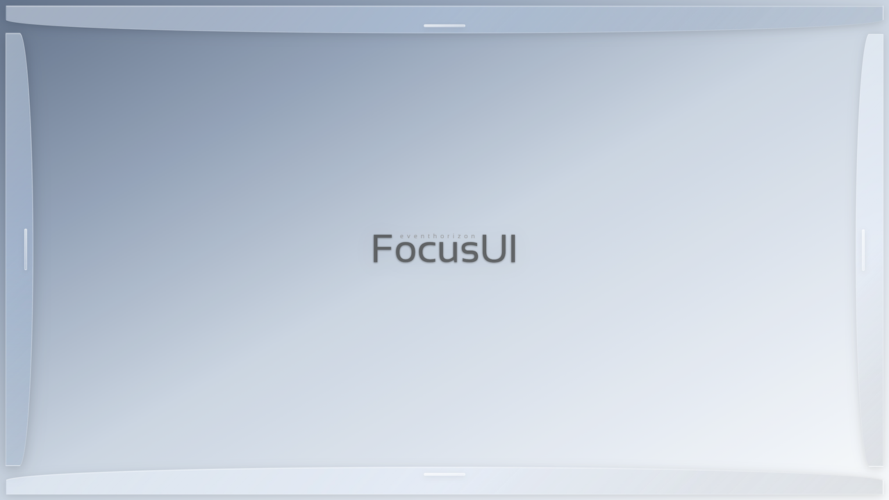
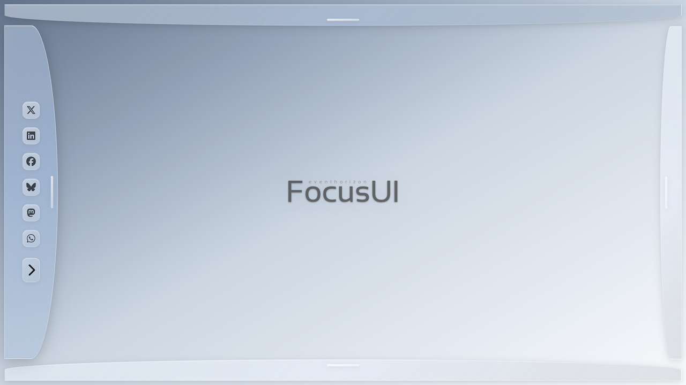
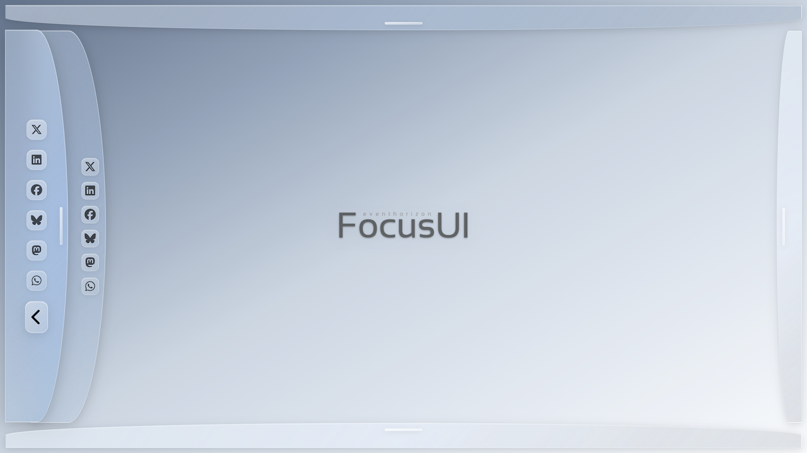
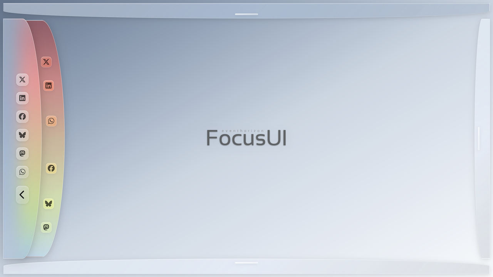

# FocusUI

FocusUI is a new type of web interface that allows users to focus on the important content and actions while minimizing distractions and clutter. It is designed to be simple, intuitive, and easy to use, with a focus on accessibility and inclusivity. It is built on top of the latest web technologies and is compatible with all modern browsers.

## Design Philosophy

The entire interface follows a left-to-right user journey approach (this can be adjusted later): on the left hand side there are all the input streams, on the right hand side there are all the output streams, and in the middle there is the main action area.

There are no menus, the interaction in the middle section is based on the actual content that's being displayed.

## Live Implementation Screenshots

### Current Working Interface

FocusUI has been implemented with a beautiful glass morphism design and advanced drawer system:

#### Base Interface with Glass Effects

Clean, minimalist interface featuring glass morphism drawers with backdrop blur effects and subtle transparency.

#### Expanded Primary Drawer with Social Media Icons

Left drawer expanded showing social media icons with consistent glass styling and smooth animations.

#### Dual Drawer System - Primary and Secondary Navigation

Advanced dual drawer system with proper z-index layering, where the secondary drawer provides additional navigation options while maintaining visual hierarchy.

## Concept Evolution

The design concepts in the `concepts/` folder demonstrate a systematic exploration of drawer-based navigation layouts:

### Basic Layout Concepts (001-006)

- **Concept 001**: Left sidebar/drawer in collapsed state
- **Concept 002**: Right sidebar/drawer in collapsed state  
- **Concept 003**: Dual drawers (left + right) simultaneously
- **Concept 004**: Three-panel layout (left + right + top)
- **Concept 005**: Four-panel layout (left + right + top + bottom)
- **Concept 006**: Expanded left drawer demonstration

As the data from the various sources gets streamed, their relevance and importance are calculated.

Only the most important sources are displayed in the second, extended drawer.

...and, as part of the first prototype:

### Functional Implementation (010)

The final concepts show actual functionality with populated sidebars:

- **010-incoming-sources-expanded**: Fully populated left sidebar featuring various application icons for communication, productivity, and file management tools
- **010-incoming-sources-expanded-importance**: Same layout with visual priority indicators using color coding (orange/red gradient) to highlight important sources

### Key Design Principles

- **Focus-oriented interface**: Keeps main workspace clean and uncluttered
- **Modular drawer system**: Collapsible panels organize different input/output sources
- **Visual hierarchy**: Color coding for importance and categorization
- **Progressive disclosure**: Panels can be added incrementally based on user needs

### Implementation Phases

#### Phase 1: Core Layout

- Implement basic drawer system (left, right, top, bottom)
- Add responsive behavior and animations
- Create theme system for consistent styling

#### Phase 2: Content Integration

- Add icon/source management system
- Implement priority/importance indicators
- Create drag-and-drop functionality for organizing sources

#### Phase 3: Advanced Features

- Add keyboard shortcuts and accessibility features
- Implement user preferences and state persistence
- Add real-time updates and notifications

#### Phase 4: Polish & Performance

- Optimize bundle size and loading performance
- Add advanced animations and micro-interactions
- Implement comprehensive testing suite
