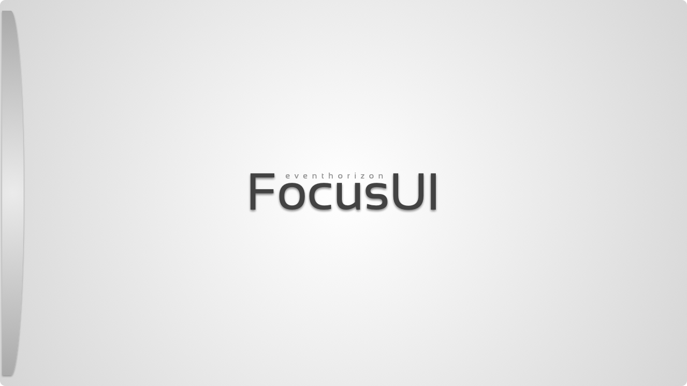
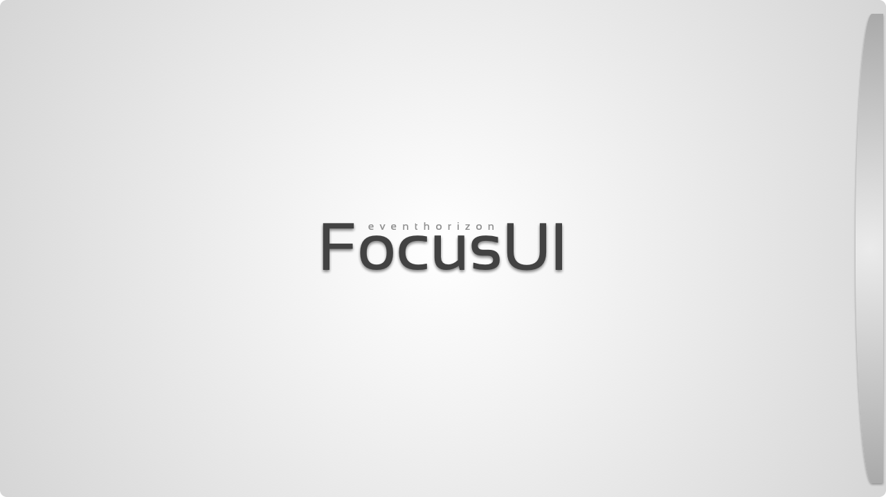
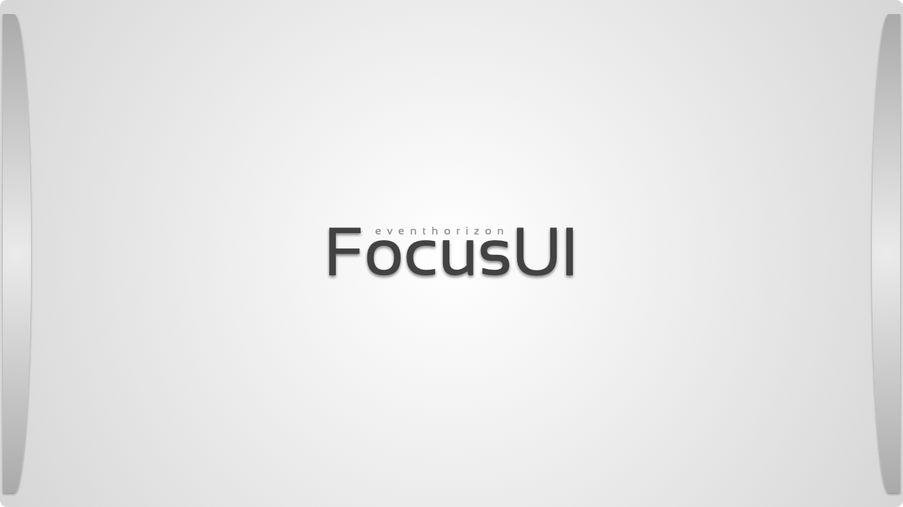
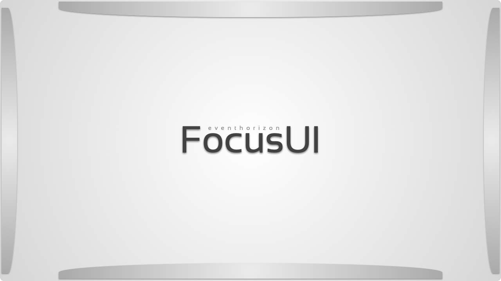
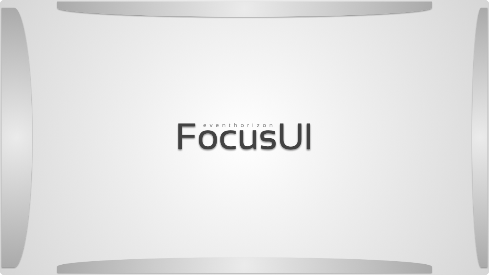
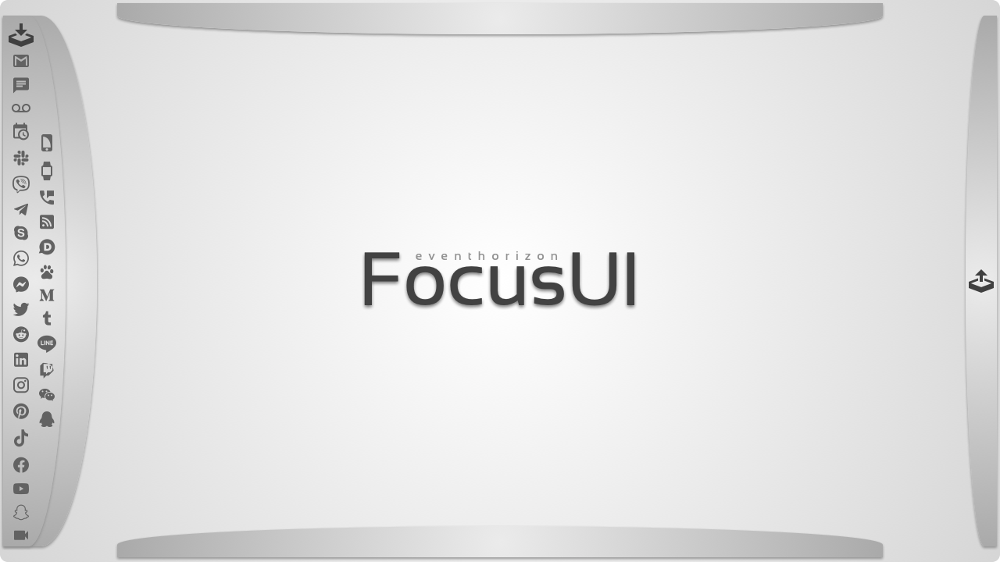
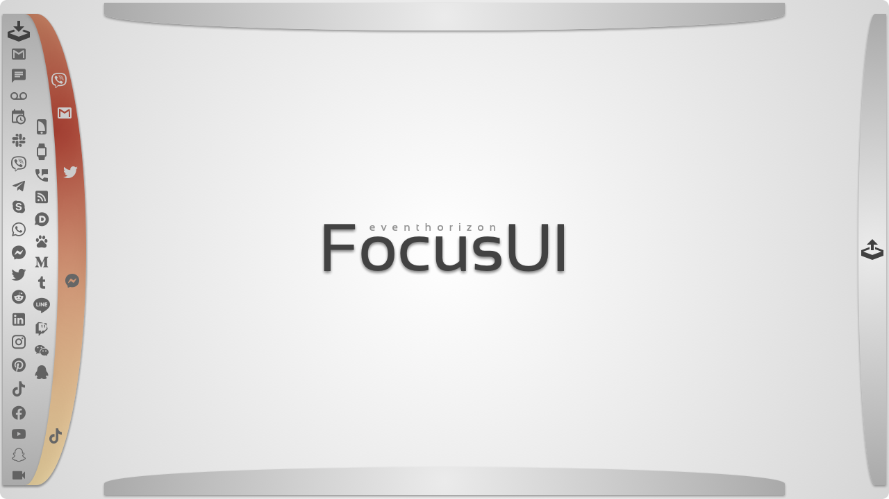

# Focus UI

Focus UI is a new type of web interface that allows users to focus on the important content and actions while minimizing distractions and clutter. It is designed to be simple, intuitive, and easy to use, with a focus on accessibility and inclusivity. It is built on top of the latest web technologies and is compatible with all modern browsers.

## Design Philosophy

The entire interface follows a left-to-right user journey: on the left hand side there are all the input streams, on the right hand side there are all the output streams, and in the middle there is the main action area.

There are no menus, the interaction in the middle section is based on the actual content that's being displayed.

## Visual Concept Evolution

### Basic Layout Progression

The design evolved through systematic exploration of drawer-based navigation:

#### Single Drawer Concepts




Left and right drawer concepts showing the foundation of the modular system

#### Multi-Drawer Layouts




Evolution to dual drawers and the complete four-drawer system

#### Functional Implementation




Expanded drawer functionality and real-world application integration

#### Priority and Importance Indicators



Visual hierarchy with color-coded importance levels for source prioritization

## Concept Evolution

The design concepts in the `concepts/` folder demonstrate a systematic exploration of drawer-based navigation layouts:

### Basic Layout Concepts (001-006)

- **Concept 001**: Left sidebar/drawer in collapsed state
- **Concept 002**: Right sidebar/drawer in collapsed state  
- **Concept 003**: Dual drawers (left + right) simultaneously
- **Concept 004**: Three-panel layout (left + right + top)
- **Concept 005**: Four-panel layout (left + right + top + bottom)
- **Concept 006**: Expanded left drawer demonstration

### Functional Implementation (010)

The final concepts show actual functionality with populated sidebars:

- **010-incoming-sources-expanded**: Fully populated left sidebar featuring various application icons for communication, productivity, and file management tools
- **010-incoming-sources-expanded-importance**: Same layout with visual priority indicators using color coding (orange/red gradient) to highlight important sources

### Key Design Principles

- **Focus-oriented interface**: Keeps main workspace clean and uncluttered
- **Modular drawer system**: Collapsible panels organize different input/output sources
- **Visual hierarchy**: Color coding for importance and categorization
- **Progressive disclosure**: Panels can be added incrementally based on user needs
- **Consistent branding**: Centered "FocusUI" logo maintains brand presence

## Technology Recommendations

### Frontend Framework Options

#### Option 1: React + TypeScript (Recommended)

**Best for**: Complex state management, component reusability, large team development

```bash
# Core dependencies
- React 18+ with TypeScript
- Vite or Next.js for build tooling
- React Query/TanStack Query for data fetching
- Zustand or Redux Toolkit for state management
```

**Pros**: Mature ecosystem, excellent TypeScript support, extensive component libraries
**Cons**: Steeper learning curve, larger bundle size

#### Option 2: Vue 3 + TypeScript

**Best for**: Rapid prototyping, gentle learning curve, progressive enhancement

```bash
# Core dependencies  
- Vue 3 with Composition API
- Vite for build tooling
- Pinia for state management
- Vue Query for data fetching
```

**Pros**: Easier to learn, excellent documentation, smaller bundle size
**Cons**: Smaller ecosystem compared to React

#### Option 3: Svelte/SvelteKit

**Best for**: Performance-critical applications, minimal bundle size

```bash
# Core dependencies
- SvelteKit for full-stack framework
- TypeScript support built-in
- Svelte stores for state management
```

**Pros**: Smallest bundle size, compile-time optimizations, simple syntax
**Cons**: Smaller community, fewer third-party components

### UI Component Libraries

#### For React

- **Radix UI**: Unstyled, accessible components (recommended for custom design)
- **Mantine**: Full-featured with drawer/sidebar components
- **Chakra UI**: Simple, modular component library

#### For Vue

- **Headless UI**: Unstyled, accessible components
- **Quasar**: Full-featured Vue framework with drawer components
- **Naive UI**: TypeScript-first component library

### Styling Solutions

#### CSS-in-JS (React)

```bash
- Styled Components or Emotion
- Theme support for consistent design system
```

#### Utility-First CSS

```bash
- Tailwind CSS (framework agnostic)
- UnoCSS for atomic CSS generation
```

#### CSS Modules

```bash
- Scoped styling with build-time optimization
- Works with any framework
```

### Animation Libraries

```bash
- Framer Motion (React) - Advanced animations and gestures
- Auto-Animate - Simple, automatic animations
- GSAP - High-performance animations (framework agnostic)
- Lottie - Vector animations from After Effects
```

### Drawer/Sidebar Implementation

#### Key Features to Implement

- **Responsive behavior**: Collapse on mobile, expand on desktop
- **Gesture support**: Swipe to open/close on touch devices
- **Keyboard navigation**: Accessible drawer controls
- **State persistence**: Remember user's drawer preferences
- **Smooth animations**: 60fps transitions between states

#### Technical Considerations

```javascript
// Example drawer state management
const drawerState = {
  left: { isOpen: false, width: 280 },
  right: { isOpen: false, width: 320 },
  top: { isOpen: false, height: 200 },
  bottom: { isOpen: false, height: 150 }
}
```

### Development Workflow

#### Recommended Stack

```bash
# Build Tools
- Vite (fast development server)
- TypeScript (type safety)
- ESLint + Prettier (code quality)

# Testing
- Vitest (unit testing)
- Playwright (e2e testing)
- Storybook (component development)

# Deployment
- Vercel/Netlify (static hosting)
- Docker (containerized deployment)
```

### Implementation Phases

#### Phase 1: Core Layout

- Implement basic drawer system (left, right, top, bottom)
- Add responsive behavior and animations
- Create theme system for consistent styling

#### Phase 2: Content Integration

- Add icon/source management system
- Implement priority/importance indicators
- Create drag-and-drop functionality for organizing sources

#### Phase 3: Advanced Features

- Add keyboard shortcuts and accessibility features
- Implement user preferences and state persistence
- Add real-time updates and notifications

#### Phase 4: Polish & Performance

- Optimize bundle size and loading performance
- Add advanced animations and micro-interactions
- Implement comprehensive testing suite
